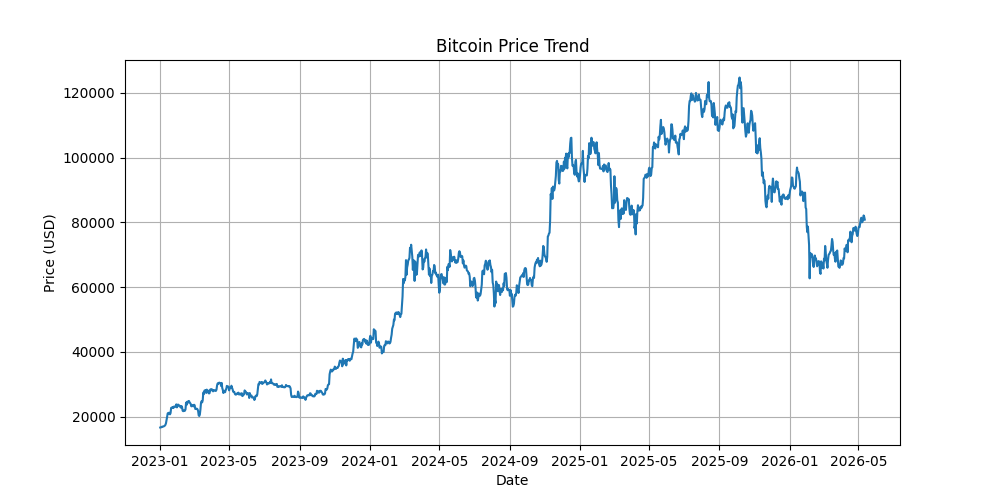

Bitcoin Price Trend Analysis

* Objective
비트코인 가격 흐름을 시각화하여 시장의 주요 변동 구간을 파악한다.

* Data
Source: Yahoo Finance (BTC-USD)
Period: 2023 ~

* Analysis
비트코인의 종가 데이터를 활용하여 시계열 그래프로 시각화하였다.
전체적으로 상승과 하락이 반복되는 높은 변동성을 확인할 수 있다.

* Key Finding
2024년 11월을 기점으로 비트코인 가격이 급격하게 상승하는 구간이 나타난다.
이후 2025년 초까지 상승 흐름이 이어지며 고점을 형성한다.
이후에는 조정 구간에 들어가며 가격이 하락하는 패턴을 보인다.

* Insight
해당 급등 구간은 시장 유동성 증가, 금리 기대 변화, 또는 기관 투자 유입 등의 영향으로 해석할 수 있다.
비트코인은 거시경제 변수와 시장 심리에 크게 영향을 받는 자산임을 확인할 수 있다.
따라서 단순 가격 추적뿐 아니라 금리, 인플레이션 등 외부 데이터와 함께 분석할 필요가 있다.

